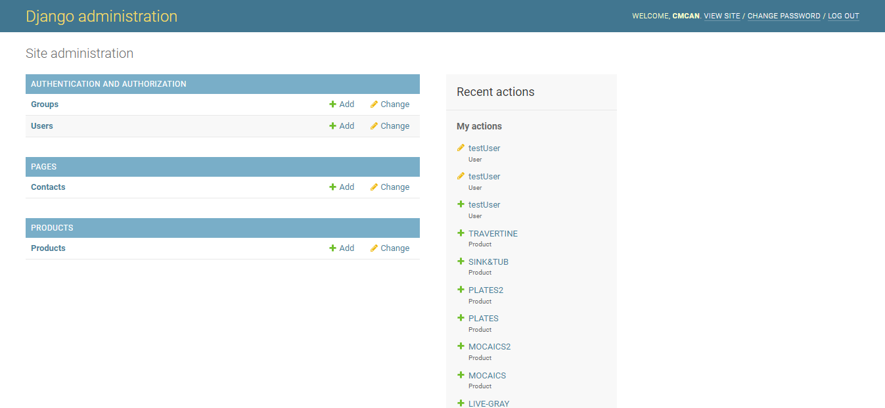
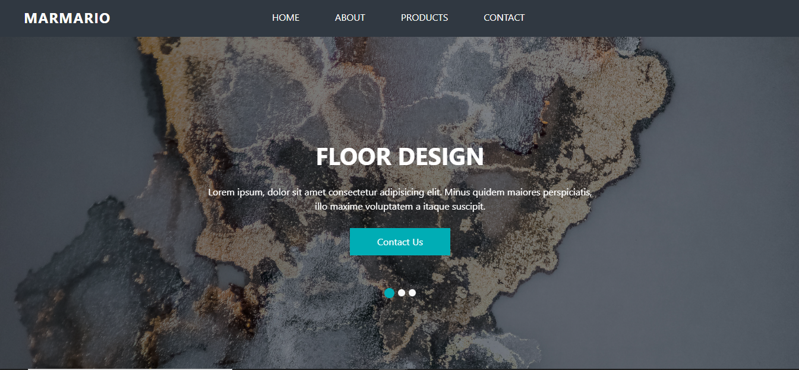
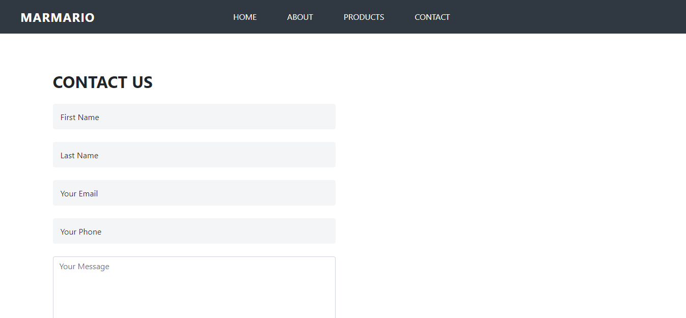

# Marmario Live - Marble Sale Website Project
Marmario-Live

## About the project

Can accessable the web site from [Marmario](https://marmario.herokuapp.com/admin).
The website include Home, About, Products and Contact sections. The site is dynamically created. On the Products page, products are added as dynamically in the Admin panel. Messages written in the Contact section can be viewed from the Admin panel.

## Admin Panel

Can accessable the Admin panel from [Marmario](https://marmario.herokuapp.com/admin/). 
There are three sections in the Admin panel, Authentication and Authorization, Pages and Products.
- In the Authentication and Authorization section, user, super user can be added, edited and deleted.
- In the Pages section, messages written in the Contact section can be viewed and deleted.
- In the Products section, products can be added, edited and deleted.

## General

The application is written using Django v4.0.4.
Gunicorn Technology is used as Wsgi Http Server.
Asgiref Technology is used as Asynchronous Server Gateway Interface.
The application is deployed using Heroku App.

**Note**
For the reason the Heroku App is used for free, dynamically uploaded product photos can not appear.

